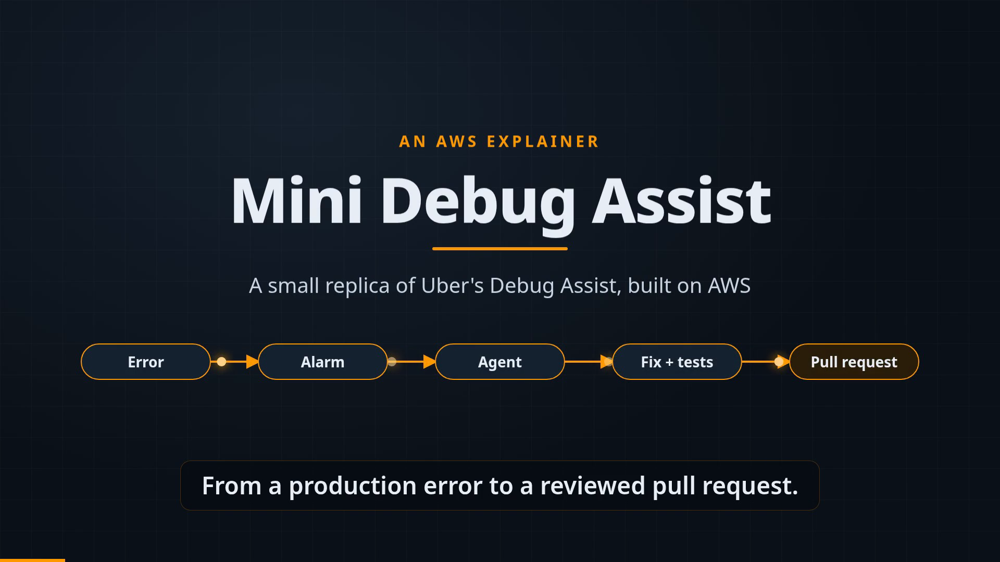
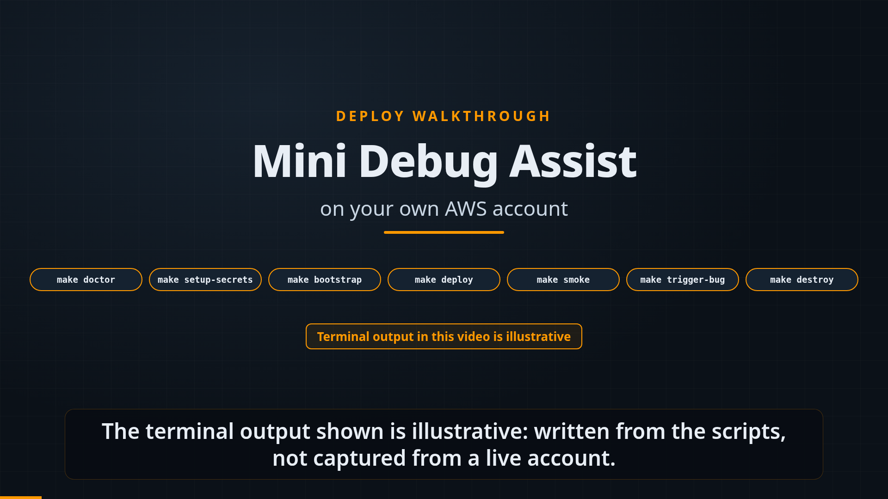
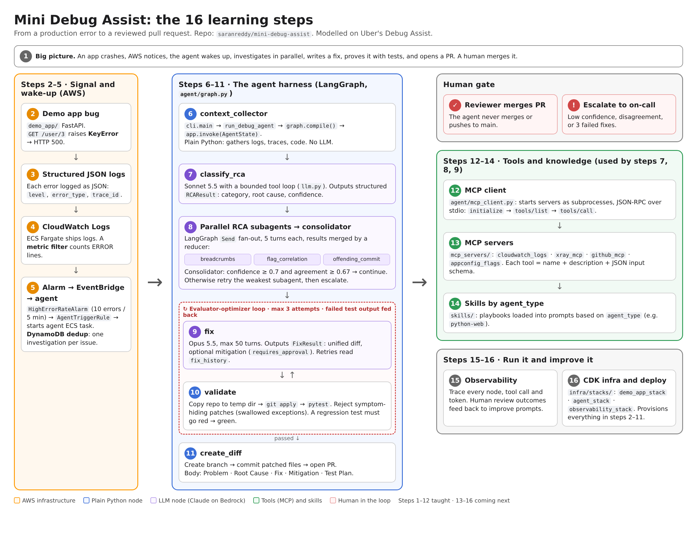

# Mini Debug Assist

[](https://github.com/saranreddy/mini-debug-assist/actions/workflows/ci.yml)
[](https://opensource.org/licenses/MIT)
[](https://www.python.org/downloads/)
[](https://aws.amazon.com/cdk/)

**Download-and-deploy mini replica of Uber's Debug Assist**: A CloudWatch alarm wakes a LangGraph agent on Bedrock that finds the root cause, writes a fix, validates it with tests, and opens a PR.

A learning-focused demo of modern agentic patterns for platform engineers: Multi-agent orchestration via LangGraph, real-world AWS integration (Bedrock/CloudWatch/DynamoDB), MCP tool protocols, and autonomous code modification with safety guardrails.

## Watch the Videos

### What it is: the 2.5-Minute Explainer

[](docs/explainer.mp4)

*Watch this first if you know AWS but not necessarily code: a 2:37 tour of the architecture, agent pipeline, and AWS deployment.*

### How to deploy it in your own AWS account: the Deploy Walkthrough

[](docs/deploy-walkthrough.mp4)

*Watch this when you're ready to run it in your own AWS account: a 4:38 step-by-step of the Quick Start, from `make doctor` to `make destroy` (terminal output is illustrative).*

## Who Should Use This

This repo is for engineers learning about autonomous agents, AI-powered debugging, and event-driven AWS architectures—especially those building internal tooling or studying production agent patterns.

**Good fit when you want to:**
- Study a complete multi-agent system (RCA, fix generation, validation, PR creation)
- Learn LangGraph orchestration with parallel subagents and bounded tool loops
- See Model Context Protocol (MCP) in practice with real stdio servers
- Understand how Uber-style debugging agents work (based on their public talks)
- Practice AWS Bedrock + CloudWatch + EventBridge workflows

**Not a good fit when you need:**
- Production-ready debugging for high-scale systems (this is a learning demo with simplified patterns)
- Support for languages beyond Python (currently Python-only demo app)
- Out-of-the-box multi-tenancy or enterprise auth (single-account demo)
- Real mobile/simulator validation (Uber's Android/iOS validation path not included)

**Cost note**: A short demo (5 investigations over 2 hours) costs ~$1-3 (primarily Bedrock API calls: $0.50-$2, plus minimal Fargate/networking). Always run `make destroy` when done to avoid ongoing charges.

## Architecture



*The 16-step learning path diagram showing: AWS infrastructure (alarm/logs/EventBridge), LangGraph agent harness (context/classify/subagents/fix/validate), MCP tools, and human gates. [View editable HTML](docs/learning-path.html)*

### Key Components

1. **AWS Trigger Path**: CloudWatch alarm on error count → EventBridge rule → ECS Fargate task with DynamoDB deduplication
2. **LangGraph Orchestration**: Supervisor pattern with conditional routing across 11 nodes
3. **Parallel RCA Subagents**: breadcrumbs, flag_correlation, offending_commit run concurrently via `Send`
4. **Consolidator**: Aggregates subagent evidence, retries weakest on disagreement, escalates to human on low confidence
5. **Fix Generation**: Claude Opus 5.5 with bounded tool loops (max 50 turns), reads fix_history for retry feedback
6. **Validation**: Copies repo to temp dir, applies patch with `git apply`/`patch -p1`, runs pytest, checks for symptom-hiding
7. **GitHub Integration**: Commits changes via Git Database API, opens PR with RCA summary and test results
8. **MCP Servers**: CloudWatch Logs, X-Ray, GitHub, AppConfig flags—all JSON-RPC 2.0 over stdio
9. **Safety Guardrails**: Symptom-hiding detection (rejects try/except: pass), turn caps, human-in-the-loop escalation gates

### Component List

- **Demo App** (FastAPI): Three planted bugs (KeyError, performance loop, division by zero)
- **Agent Harness** (LangGraph + Bedrock): 11-node pipeline with Claude Sonnet 5.5 / Opus 5.5
- **MCP Servers** (Python + official SDK): 4 servers (cloudwatch_logs, xray, github_mcp, appconfig_flags)
- **AWS Infrastructure** (CDK): ECS, EventBridge, CloudWatch, DynamoDB, IAM with least privilege
- **Test Suite**: 53 tests (unit + integration + e2e), all passing

## Prerequisites

- **AWS CLI** configured with credentials (`aws configure`)
- **AWS CDK** >= 2.150 (`npm install -g aws-cdk`)
- **Docker** (for building agent container image)
- **Python** 3.12+
- **Node.js** 20+ (for CDK)
- **Bedrock Model Access**: Request access in AWS Console → Bedrock → Model access for:
  - `anthropic.claude-sonnet-5-5` (US East inference profile)
  - `anthropic.claude-opus-5-5` (US East inference profile)

## Quick Start

### 1. Check Prerequisites

Ensure you have:
- **AWS CLI** configured (`aws configure`)
- **AWS CDK** >= 2.150 (`npm install -g aws-cdk`)
- **Docker** for building container images
- **Python** 3.12+
- **Node.js** 20+

### 2. Request Bedrock Model Access

Go to AWS Console → Bedrock → Model access and request access for:
- `anthropic.claude-sonnet-5-5` (US East inference profile)
- `anthropic.claude-opus-5-5` (US East inference profile)

Wait for approval (usually instant).

### 3. Fork and Clone

Fork this repo to your own GitHub account:

```bash
# Clone your fork
git clone https://github.com/YOUR-USERNAME/mini-debug-assist
cd mini-debug-assist
```

The agent will open PRs in **your fork**, not the original repo.

### 4. Configure AWS Credentials

```bash
aws configure
# Enter your AWS Access Key ID, Secret Access Key, and region (us-east-1)
```

### 5. Verify Setup

```bash
make doctor
```

This checks AWS credentials, CDK, Docker, Python, and **Bedrock model access**. Fix any issues it reports.

### 6. Test Locally (Optional)

Test the full pipeline with no AWS costs:

```bash
make demo-local
```

This runs the agent in mock mode using test fixtures, simulating all AWS calls.

### 7. Configure GitHub Token

```bash
# Copy environment template
cp .env.example .env

# Edit .env and fill in:
# - GITHUB_TOKEN (personal access token with 'repo' scope)
# - GITHUB_REPO (your-username/mini-debug-assist)
# - AWS_REGION (default: us-east-1)

# Store token in Secrets Manager
make setup-secrets
```

### 8. Bootstrap CDK (One-Time)

```bash
make bootstrap
```

This provisions CDK resources in your AWS account (S3 bucket for assets, IAM roles). Only needed once per account/region.

### 9. Deploy Infrastructure

```bash
make deploy
```

This provisions (~5 minutes):
- Demo app (ECS Fargate service behind ALB)
- CloudWatch log group + metric filter + alarm
- EventBridge rule to trigger agent
- Agent ECS task definition with Bedrock permissions
- DynamoDB deduplication table
- IAM roles with least privilege

### 10. Verify Deployment

```bash
make smoke
```

This checks:
- Demo app `/health` endpoint responds
- CloudWatch alarm exists
- EventBridge rule is enabled
- DynamoDB table is active
- ECS task definition exists

### 11. Trigger a Bug

```bash
make trigger-bug
```

This calls the demo app's `/user/3` endpoint 12 times to trigger the planted KeyError bug, causing the CloudWatch alarm to enter ALARM state. Wait ~1 minute for:
- EventBridge to invoke the agent ECS task
- Agent to investigate, write a fix, run tests, and open a PR

Watch the logs:
```bash
aws logs tail /aws/ecs/mini-debug-assist-agent --follow
```

Watch for a PR in your fork on GitHub. The PR will include:
- Root cause analysis summary
- Unified diff of the fix
- Test validation results
- Link to the issue/alarm

### 12. Tear Down

```bash
make destroy
```

This removes all AWS resources with `--force`, leaving nothing billable. The agent stack uses `RemovalPolicy.DESTROY` on all stateful resources (DynamoDB table, log groups, ECR images) for clean teardown.

## Cost

Designed to stay within Free Tier limits or cost a few dollars for a short demo:

- **ECS Fargate**: $0.04/vCPU-hour + $0.004/GB-hour (agent task runs ~2-5 minutes per investigation)
- **Application Load Balancer**: $0.0225/hour + $0.008/LCU-hour
- **No NAT Gateway**: Demo uses public subnets with Internet Gateway (no NAT charges)
- **Bedrock API Calls**:
  - Claude Sonnet 5.5: ~$0.003 per 1K input tokens, ~$0.015 per 1K output tokens
  - Claude Opus 5.5: ~$0.015 per 1K input tokens, ~$0.075 per 1K output tokens
  - Typical investigation: 50K-150K tokens total = **$0.50-$2.00**
- **CloudWatch Logs**: $0.50/GB ingested (negligible for demo)
- **DynamoDB**: On-demand pricing, first 25 RCU/WCU per month free (negligible for demo)
- **EventBridge**: First 60M custom events/month to Lambda/ECS free (negligible for demo)

**Estimated total cost for 5 investigations over 2 hours: $1-3** (primarily Bedrock API calls + minimal compute/storage)

**Note**: The demo deploys to public subnets with no NAT Gateway, minimizing networking costs. Fargate tasks get outbound internet via Internet Gateway (free).

Always run `make destroy` when done to avoid ongoing charges.

## Configuration

### Environment Variables

See [`.env.example`](.env.example) for all variables. Key settings:

```bash
# AWS
AWS_REGION=us-east-1                  # Deploy region

# GitHub (store via make setup-secrets)
GITHUB_TOKEN=ghp_xxx...               # Personal access token with 'repo' scope
GITHUB_REPO=your-username/mini-debug-assist

# Bedrock Models (optional overrides)
MODEL_CLASSIFY=us.anthropic.claude-sonnet-5-5
MODEL_FIX=us.anthropic.claude-opus-5-5

# MCP (optional, for testing)
MCP_MOCK_MODE=false                   # true = in-process mocks, false = real stdio servers

# LangSmith (optional observability)
LANGSMITH_API_KEY=lsv2_pt_xxx...
LANGSMITH_PROJECT=mini-debug-assist
```

### CDK Context (Optional)

Override defaults in `infra/cdk.context.json` or pass via CLI:

```bash
cd infra
cdk deploy --context usePublicSubnets=true  # Skip NAT Gateway, save cost
```

**Available contexts:**
- `usePublicSubnets` (default: false): Set to `true` to deploy agent tasks in public subnets with Internet Gateway instead of private subnets with NAT Gateway. Saves ~$0.09/hour but exposes task to public internet (acceptable for demo).

### Agent Retry Limits

In `agent/config.py`:
```python
max_validation_retries: int = 3        # Fix → validate retry loop
max_turns_fix: int = 50                # Opus tool-use turns
max_turns_classify: int = 20           # Sonnet tool-use turns
```

## How It Maps to Uber's Debug Assist

| Uber's Debug Assist | This Demo | Notes |
|---------------------|-----------|-------|
| 11 MCP servers (Jaeger, Sourcegraph, logging) | 4 MCP servers (CloudWatch, X-Ray, GitHub, AppConfig) | Simplified but same stdio protocol |
| 8 agent types (Go/Java/Android/iOS/Web) | 1 agent type (Python web) | Pattern generalizes |
| Phabricator diffs | GitHub PRs | Same Git workflow |
| Bazel tests + mobile simulators | pytest in temp dir | Mobile validation not included |
| Flipr feature flag rollbacks | AppConfig flags | Same mitigation pattern |
| Metadata DB (investigation history) | DynamoDB deduplication | Simplified tracking |
| Kubernetes runtime jobs | ECS Fargate tasks | Managed containers |
| Claude 3 Opus/Sonnet | Claude 5.5 Opus/Sonnet | Latest models |

**Key differences**: Uber's system is production-hardened for massive scale (millions of crashes/day), multi-repo, and multi-platform. This demo focuses on learning the **architecture patterns** in a deployable, hackable form.

## Current Status

### ✅ Real Implementations

**Agent Pipeline:**
- ✅ LangGraph orchestration with 11 nodes (context → classify → subagents → consolidate → fix → validate → create_diff → human gate)
- ✅ Parallel RCA subagents via `Send` with state merging (`breadcrumbs`, `flag_correlation`, `offending_commit`)
- ✅ Consolidator retry/escalation logic based on confidence and agreement scores
- ✅ Fix node with bounded tool loops (Bedrock Converse API, max 50 turns) and `fix_history` feedback
- ✅ Validation node: copies repo to temp dir, applies patches with `git apply`/`patch -p1`, runs pytest
- ✅ Symptom-hiding detection: rejects `try/except: pass`, silent failures, broad exception handling
- ✅ GitHub PR creation: commits via Git Database API (blobs → tree → commit), includes RCA and test results

**AWS Integration:**
- ✅ CloudWatch alarm on error count (10 errors in 5 minutes)
- ✅ EventBridge rule triggers ECS task on alarm state change
- ✅ DynamoDB deduplication (one investigation per error signature per hour)
- ✅ ECS Fargate task definition with Bedrock IAM permissions
- ✅ Agent Docker image built from workspace via `ContainerImage.from_asset`
- ✅ CloudWatch Logs and X-Ray tracing (optional in demo app)

**MCP Integration:**
- ✅ JSON-RPC 2.0 over stdio: `initialize`, `notifications/initialized`, `tools/list`, `tools/call`
- ✅ Request/response matching by ID, skips notifications and log lines
- ✅ 4 Python MCP servers using official `mcp` SDK (cloudwatch_logs, xray, github_mcp, appconfig_flags)
- ✅ Real mode never silently falls back to mocks (returns `isError` on unknown tools)
- ✅ Subprocess lifecycle management with timeouts and cleanup

**Models:**
- ✅ Claude Sonnet 5.5 for classify, subagents, validate, create_diff (fast, cost-effective)
- ✅ Claude Opus 5.5 for fix and escalate (reasoning, complex code changes)
- ✅ Cross-region inference profiles (`us.anthropic.claude-*`) for geo routing
- ✅ Model IDs from AWS docs (Oct 2026): https://docs.aws.amazon.com/bedrock/latest/userguide/model-card-anthropic-claude-sonnet-5-5.html

**Testing:**
- ✅ 53 tests passing (48 unit, 3 integration, 2 e2e)
- ✅ Mock mode for local development (no AWS costs)
- ✅ Regression tests for demo app bugs (marked xfail on unpatched app)
- ✅ MCP protocol tests with real stdio servers

### 🔧 Mock Mode (Preserved for Learning)

When `mode="mock"` or `MCP_MOCK_MODE="true"`:
- ✅ Context collection returns fixture data (no AWS API calls)
- ✅ Classify returns mock RCA result (no Bedrock calls)
- ✅ Fix returns mock changes (no Bedrock calls)
- ✅ Validate returns mock pass/fail (no pytest execution)
- ✅ Create_diff returns mock PR URL (no GitHub API calls)
- ✅ MCP tools use in-process mocks (no stdio servers)

**This is intentional for local development and testing without credentials.** Real mode works end-to-end when deployed to AWS.

### 🚧 Not Yet Implemented

- **Slack notifications**: MCP server exists but not wired to agent nodes
- **Jira integration**: Would require additional MCP server
- **Mobile emulators**: Uber's Android/iOS validation path not included
- **Multi-repository support**: Currently single-repo only
- **Skill marketplace**: Fix strategies are hardcoded (Uber uses a dynamic skill library)
- **LangSmith traces**: Integration exists but optional (enable with `LANGSMITH_API_KEY`)

## Learning Path

The full learning journey is documented in [`docs/LEARNING_PATH.md`](docs/LEARNING_PATH.md), covering:

1. How production errors wake the agent (EventBridge + ECS)
2. LangGraph multi-agent orchestration patterns
3. Bedrock Converse API with tool use
4. MCP (Model Context Protocol) for tool integration
5. Symptom-hiding detection and safety guardrails
6. GitHub API integration (Git Database API)
7. AWS infrastructure patterns (CDK, IAM least privilege)
8. Testing strategies for agent systems

**16-Step Visual Map**: See [diagram](docs/learning-path.png) showing the complete flow from alarm to merged PR.

**External Resources**:
- [Uber's Talk: Scalable AI Crash Triage (QCon 2024)](https://www.infoq.com/presentations/uber-ai-crash-triage/)
- [LangGraph Multi-Agent Patterns](https://langchain-ai.github.io/langgraph/tutorials/multi_agent/)
- [Model Context Protocol Spec](https://modelcontextprotocol.io/introduction)
- [AWS Bedrock Converse API](https://docs.aws.amazon.com/bedrock/latest/userguide/conversation-inference.html)

## Troubleshooting

### Bedrock Access Denied

**Error**: `AccessDeniedException` when calling Bedrock models.

**Fix**:
1. Go to AWS Console → Bedrock → Model access
2. Request access for `Claude Sonnet 5.5` and `Claude Opus 5.5`
3. Wait for approval (usually instant for Sonnet, may take 1-2 minutes for Opus)
4. Run `make doctor` to verify access

### Alarm Not Firing

**Error**: Triggered bugs but no agent task started.

**Check**:
```bash
# View alarm state
aws cloudwatch describe-alarms --alarm-names mini-debug-assist-error-alarm

# Check metric data
aws cloudwatch get-metric-statistics \
  --namespace "MiniDebugAssist/Demo" \
  --metric-name ErrorCount \
  --start-time $(date -u -d '10 minutes ago' +%Y-%m-%dT%H:%M:%S) \
  --end-time $(date -u +%Y-%m-%dT%H:%M:%S) \
  --period 60 \
  --statistics Sum
```

**Common causes**:
- Not enough errors (need 10 in 5 minutes): run `make trigger-bug` again
- Metric filter not working: check `/aws/ecs/mini-debug-assist-demo` in CloudWatch Logs for JSON lines with `"level": "ERROR"`
- Alarm evaluation period not met: wait full 5 minutes

### PR Not Created

**Error**: Agent ran but no PR appeared in GitHub.

**Check**:
```bash
# View agent logs
aws logs tail /aws/ecs/mini-debug-assist-agent --follow

# Look for errors like:
#   - "GitHub credentials not configured"
#   - "Failed to create branch"
#   - "Patch did not apply cleanly"
```

**Common causes**:
- GitHub token not stored: run `make setup-secrets` again
- Target repo not forked: the agent opens PRs in **your fork**, not the original repo
- Branch already exists: agent won't overwrite existing branches (delete manually or use new issue)

### CDK Bootstrap Failed

**Error**: `cdk deploy` fails with "This stack uses assets, so the toolkit stack must be deployed".

**Fix**:
```bash
make bootstrap

# If that fails, bootstrap explicitly:
cdk bootstrap aws://ACCOUNT-ID/REGION
```

**Common cause**: First time deploying CDK in this account/region. Bootstrap is one-time per account/region.

### Docker Build Failed

**Error**: CDK deploy fails building agent Docker image.

**Check**:
- Docker daemon is running: `docker ps`
- Disk space available: `df -h`
- Network access for pulling base images

**Fix**:
```bash
# Test the Docker builds locally (from the repo root)
docker build -t mini-debug-assist-agent -f agent/Dockerfile .
docker build -t mini-debug-assist-demo demo_app/

# If successful, try deploy again
make deploy
```

## Project Structure

```
mini-debug-assist/
├── README.md
├── LICENSE
├── Makefile
├── pyproject.toml
├── requirements.txt
├── .env.example
│
├── agent/                      # LangGraph agent harness
│   ├── cli.py                  # CLI entry point
│   ├── config.py               # Model IDs, turn caps
│   ├── state.py                # AgentState dataclass
│   ├── llm.py                  # Bedrock Converse API
│   ├── mcp_client.py           # MCP JSON-RPC client
│   ├── dedup.py                # DynamoDB deduplication
│   ├── graph.py                # LangGraph orchestration
│   └── nodes/                  # Agent nodes
│       ├── context_collector.py
│       ├── classify.py
│       ├── fix.py
│       ├── validate.py
│       ├── create_diff.py
│       ├── consolidator.py
│       └── subagents/          # Parallel RCA subagents
│
├── mcp_servers/                # MCP servers (JSON-RPC over stdio)
│   ├── cloudwatch_logs.py
│   ├── xray_mcp.py
│   ├── github_mcp.py
│   └── appconfig_flags.py
│
├── demo_app/                   # FastAPI app with planted bugs
│   ├── main.py
│   ├── config.py
│   ├── requirements.txt        # Container runtime deps
│   └── Dockerfile              # Image built by CDK (from_asset)
│
├── infra/                      # AWS CDK infrastructure
│   ├── app.py                  # CDK app
│   ├── requirements.txt
│   └── stacks/
│       ├── demo_app_stack.py   # Demo app (ECS + ALB)
│       ├── agent_stack.py      # Agent (ECS task + IAM)
│       └── observability_stack.py  # Logs + alarms + EventBridge
│
├── tests/                      # Test suite
│   ├── fixtures/               # Mock issues and responses
│   ├── test_agent_graph.py     # LangGraph routing
│   ├── test_llm_tool_use.py    # Bedrock tool loops
│   ├── test_validate_patch.py  # Patch application
│   ├── test_create_diff_commit.py  # GitHub API
│   ├── test_mcp_jsonrpc.py     # MCP protocol
│   └── test_e2e_local.py       # End-to-end pipeline
│
├── scripts/                    # Deployment helpers
│   ├── doctor.py               # Prerequisites check
│   ├── setup_github_token.sh   # Store GitHub token
│   ├── trigger_bug.py          # Trigger demo bug
│   └── smoke.py                # Post-deploy validation
│
├── docs/                       # Documentation
│   ├── LEARNING_PATH.md        # 16-step learning guide
│   ├── learning-path.png       # Architecture diagram
│   └── learning-path.html      # Editable diagram source
│
└── .github/
    └── workflows/
        └── ci.yml              # CI pipeline (lint + test + cdk synth)
```

## Use Case

**Autonomous debugging**: A production service crashes with a KeyError or division-by-zero. CloudWatch detects high error rate and triggers an alarm. EventBridge routes the alarm to an ECS task running the agent. The agent:

1. Collects context (logs, traces, code)
2. Runs parallel RCA subagents (breadcrumbs, flag correlation, offending commit)
3. Consolidates evidence and writes a root cause analysis
4. Generates a fix using Claude Opus with bounded tool loops
5. Validates the fix by applying it in a temp repo and running pytest
6. Commits the fix to a branch via GitHub API and opens a PR
7. Escalates to human if confidence is low or tests fail after retries

**Real-world applications**:
- Internal tools crash triage for platform teams
- Automated incident response for known error patterns
- Code quality automation (performance, reliability fixes)
- Learning lab for agent patterns and AWS orchestration

## CI

The CI workflow (`.github/workflows/ci.yml`) runs on every push and PR:
- **Lint**: `ruff`, `black --check`, `mypy`
- **Test**: `pytest` with coverage
- **CDK Synth**: Validate infrastructure code

All checks must pass before merge.

## Contributing

This is a learning demo. Fork it, customize it, and make it your own. Contributions welcome via issues and PRs.

Ideas for extensions:
- Add more MCP servers (Slack, Jira, PagerDuty)
- Implement mobile simulator validation
- Build skill marketplace for fix strategies
- Add multi-repository support
- Integrate with LangSmith for full tracing

## Author

**Saran Alla**  
GitHub: [github.com/saranreddy](https://github.com/saranreddy)  
Email: saranreddy2002@gmail.com

## License

MIT License - see [LICENSE](LICENSE) for details.

Copyright (c) 2026 Saran Alla

---

**Ready to deploy?** Start with `make doctor` to check prerequisites, then follow the [Quick Start](#quick-start) guide above.

**Want to learn more?** See [`docs/LEARNING_PATH.md`](docs/LEARNING_PATH.md) for the full 16-step learning journey.

**Current Version**: 0.1.0 (learning demo)  
**Test Coverage**: 53 passing tests  
**CI Status**: All checks passing  
**AWS Deployment**: Production-ready with CDK
