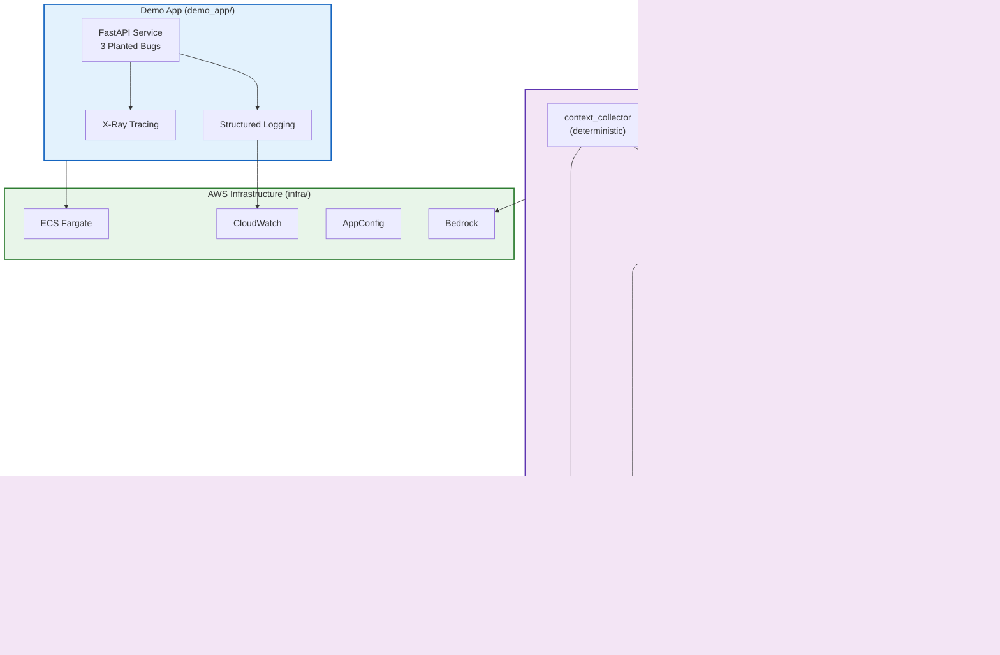

# Mini Debug Assist

A learning-grade replica of Uber's **Debug Assist** debugging-agent harness, built on AWS. This project demonstrates how to build an autonomous debugging agent that can detect production issues, perform root cause analysis, generate fixes, validate them, and create pull requests.

## 🎯 Project Goal

This is a **learning project** for understanding agentic AI architectures. The codebase prioritizes clarity, comments, and educational value over production optimization. Study it phase by phase using the [LEARNING_PATH.md](docs/LEARNING_PATH.md).

## 🏗️ Architecture Overview



## 🗺️ Component Mapping to Uber's System

| **Mini Debug Assist** | **Uber's Debug Assist** | **Purpose** |
|----------------------|------------------------|-------------|
| FastAPI demo app | Production services | Service with bugs to debug |
| CloudWatch Logs | ClickHouse logging platform | Structured log storage |
| X-Ray | Jaeger | Distributed tracing |
| AppConfig | Flipr | Feature flags |
| GitHub MCP | Sourcegraph MCP | Code search and PR creation |
| LangGraph pipeline | LangGraph pipeline | Fixed orchestration plan |
| Claude via Bedrock | Claude (direct or gateway) | LLM inference |
| context_collector | context_collector | Deterministic log pruning |
| classify_rca | classify/RCA (Sonnet, 20 turns) | Root cause analysis |
| fix | fix (Opus, 30-50 turns) | Generate code fix |
| validate | bazel_test (Sonnet, 20 turns) | Run tests in sandbox |
| create_diff | create_diff (Sonnet, 20 turns) | Create GitHub PR |
| Skills markdown | ~3,000 skill marketplace | Domain knowledge base |
| ECS Fargate | Kubernetes | Container orchestration |
| CodeBuild | Bazel CI | Test execution |

## 🚀 Quick Start

### Prerequisites

- Python 3.11+
- AWS CLI configured (for real mode)
- GitHub token (for PR creation)
- AWS Bedrock model access (Claude Sonnet & Opus)

### Installation

```bash
# Clone and install
git clone <repo-url>
cd mini-debug-assist
make install

# Or manually
pip install -e ".[dev,infra]"
```

### Run in Mock Mode (No AWS Credentials Required)

```bash
# Run the demo app locally
make run-demo

# In another terminal, run the agent in mock mode
make run-agent-mock

# Or manually
python -m agent.cli --mode mock --issue tests/fixtures/keyerror_issue.yaml
```

The agent will:
1. Load the issue fixture
2. Perform RCA (mock mode uses predefined responses)
3. Generate a fix
4. Validate it (simulated)
5. Output results to `./output/`

### Run Tests

```bash
make test

# Tests include:
# - Unit tests for demo app
# - Tests that expose the 3 planted bugs (marked xfail)
# - Agent graph tests
```

## 🐛 The Three Planted Bugs

### 1. KeyError Bug (`/user/{id}`)

```python
# User 3 is missing the 'email' field
email = user["email"]  # KeyError!
```

**Fix**: Use `user.get("email", None)`

### 2. Performance Bug (`/report`)

```python
# Recomputed every iteration - O(n*m)!
for i in range(entries):
    all_user_ids = [uid for uid in USERS_DB.keys()]  # Bad!
```

**Fix**: Hoist computation outside loop

### 3. Feature Flag Bug (`/discount`)

```python
# When DISCOUNT_V2='on' and purchase_count=0
discount_multiplier = 100 / purchase_count  # Division by zero!
```

**Fix**: Check for zero or rollback flag

## 📁 Repository Structure

```
mini-debug-assist/
├── demo_app/              # FastAPI service with bugs
│   ├── main.py           # App with 3 planted bugs
│   └── config.py         # AppConfig integration
├── agent/                 # LangGraph debugging agent
│   ├── graph.py          # Pipeline definition
│   ├── state.py          # State management
│   ├── nodes/            # Individual pipeline nodes
│   │   ├── context_collector.py
│   │   ├── classify_rca.py
│   │   ├── consolidator.py
│   │   ├── fix.py
│   │   ├── validate.py
│   │   └── create_diff.py
│   └── cli.py            # CLI entrypoint
├── mcp_servers/           # MCP tool servers
│   ├── cloudwatch_logs.py
│   ├── xray_mcp.py
│   ├── github_mcp.py
│   └── appconfig_flags.py
├── skills/                # Domain knowledge (markdown)
│   ├── python-keyerror.md
│   ├── perf-hot-loop.md
│   └── feature-flag-rollback.md
├── infra/                 # AWS CDK infrastructure
│   ├── app.py
│   └── stacks/
│       ├── demo_app_stack.py
│       ├── agent_stack.py
│       └── observability_stack.py
├── tests/                 # Test suite
│   ├── test_demo_app.py
│   └── fixtures/
├── docs/                  # Documentation
│   └── LEARNING_PATH.md  # Study guide
├── pyproject.toml
├── Makefile
└── README.md
```

## 🔧 Deploy to AWS

### Synthesize CDK

```bash
make synth

# Or manually
cd infra && cdk synth
```

This generates CloudFormation templates without deploying.

### Deploy (Not Required for Learning)

```bash
# Bootstrap CDK (first time only)
cd infra && cdk bootstrap

# Deploy stacks
cdk deploy --all

# Requires:
# - AWS account with appropriate permissions
# - Bedrock model access in your region
# - GitHub token stored in Secrets Manager
```

## 📊 Cost Notes

**Mock mode**: $0 (no AWS services)

**Deployed mode** (rough monthly estimates):
- ECS Fargate (demo app): ~$15-30
- Bedrock (Claude): $3-15 per run (depends on turns)
- CloudWatch Logs: ~$1-5
- AppConfig: Free tier
- NAT Gateway: ~$32 (most expensive!)

**Cost optimization**:
- Use mock mode for learning
- Stop ECS tasks when not testing
- Use 1 NAT gateway instead of 2
- Set short log retention (1 week)

## 🎓 Learning Path

See [docs/LEARNING_PATH.md](docs/LEARNING_PATH.md) for a structured study guide broken into 5 phases:

1. **Phase 1**: Demo app & bug patterns
2. **Phase 2**: Context collector & deterministic processing
3. **Phase 3**: RCA node & LLM integration
4. **Phase 4**: Fix & validate loop
5. **Phase 5**: MCP servers, skills, and infrastructure

Each phase includes:
- What to read
- Key concepts
- Exercises
- Things to try

## 🔍 How It Differs from Uber's System

**Simplified for learning**:
- 1 agent type vs. 8 at Uber
- 3 bugs vs. ~50K issues/year at Uber
- Mock mode for running without AWS
- 4 MCP servers vs. 11 at Uber
- ~3 skills vs. ~3,000 at Uber
- Comments explain everything

**Not implemented** (out of scope):
- Parallel RCA subagents (~30 at Uber)
- Emulator/simulator validation
- Real-time event triggers from CloudWatch
- Phabricator integration (uses GitHub)
- Slack integration
- Human-in-the-loop UI (debugassist.uberinternal.com)
- Arize tracing (basic logging instead)
- Multi-language support (Python only)

## 🧪 Running End-to-End

```bash
# 1. Start demo app
make run-demo

# 2. Trigger the KeyError bug
curl http://localhost:8000/user/3

# 3. Run agent in mock mode
make run-agent-mock

# 4. Check output
cat output/DEMO-001_result.yaml

# 5. Review the generated fix
# (In mock mode, fix is in output; in real mode, it creates a PR)
```

## 🤝 Contributing

This is a learning project. Feel free to:
- Add more bug types
- Implement additional MCP servers
- Add more skills
- Improve the RCA logic
- Add tests

## 📚 References

- **Uber Debug Assist Talk**: [YouTube](https://www.youtube.com/watch?v=iVCDIOf7vXw)
- **LangGraph**: [Documentation](https://python.langchain.com/docs/langgraph)
- **MCP (Model Context Protocol)**: [Specification](https://modelcontextprotocol.io/)
- **AWS Bedrock**: [Documentation](https://docs.aws.amazon.com/bedrock/)
- **Uber Engineering Blog**: [Flipr](https://www.uber.com/blog/flipr/), [Jaeger](https://www.uber.com/blog/distributed-tracing/)

## 📄 License

MIT (for learning purposes)

## 🙏 Acknowledgments

- Inspired by Uber's Debug Assist (Kriti Dangi et al.)
- Architecture based on AGNTCon + MCPCon Japan 2026 presentation
- Built for educational purposes to learn agentic AI patterns

---

**Next Steps**: Read [docs/LEARNING_PATH.md](docs/LEARNING_PATH.md) to start your learning journey!
